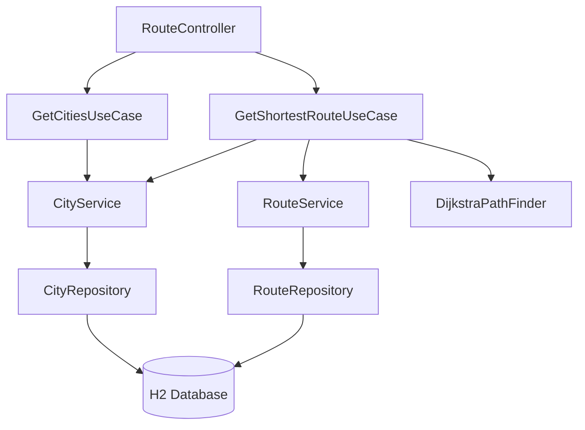

# Design Document: Airline Route Finder

## Overview

The airline route finder feature adds shortest-path route computation to the existing shipping application. It introduces two new database tables (`cities`, `routes`), two new use cases (`GetCitiesUseCase`, `GetShortestRouteUseCase`), a dedicated `RouteController`, and a `DijkstraPathFinder` algorithm class. The feature coexists with the existing shipping domain in the same H2 in-memory database under the `shipping` schema.

The system models the airline's route network as an undirected weighted graph where cities are nodes and routes are edges with distance (km) and cost (EUR) as weights. Dijkstra's algorithm computes the shortest path by distance between any two cities.

## Architecture

The feature follows the existing project architecture: `Controller → UseCase → Service → Repository`.



### Package Structure

```
com.shipping.demo
├── controller/rest/
│   └── RouteController.java
├── domain/
│   ├── city/
│   │   ├── City.java
│   │   ├── CityDto.java
│   │   ├── CityRepository.java
│   │   └── CityService.java
│   └── route/
│       ├── Route.java
│       ├── RouteDto.java
│       ├── RouteRepository.java
│       └── RouteService.java
└── usecase/
    ├── getcities/
    │   ├── GetCitiesUseCase.java
    │   └── GetCitiesResponse.java
    └── getshortestroute/
        ├── GetShortestRouteUseCase.java
        ├── GetShortestRouteRequest.java
        ├── GetShortestRouteResponse.java
        └── DijkstraPathFinder.java
```

## Components and Interfaces

### RouteController

REST controller dedicated to route-finding endpoints, separate from `ShippingController`.

```java
@RequiredArgsConstructor
@RestController
@RequestMapping(RouteController.ROUTE_API_PATH)
public class RouteController {
    public static final String ROUTE_API_PATH = "route";

    private final GetCitiesUseCase getCitiesUseCase;
    private final GetShortestRouteUseCase getShortestRouteUseCase;

    @GetMapping("cities")
    @ResponseStatus(HttpStatus.OK)
    ResponseEntity<GetCitiesResponse> getCities() {
        return ResponseEntity
                .status(HttpStatus.OK)
                .contentType(MediaType.APPLICATION_JSON)
                .body(getCitiesUseCase.execute(null));
    }

    @GetMapping("shortest")
    @ResponseStatus(HttpStatus.OK)
    ResponseEntity<GetShortestRouteResponse> getShortestRoute(GetShortestRouteRequest request) {
        return ResponseEntity
                .status(HttpStatus.OK)
                .contentType(MediaType.APPLICATION_JSON)
                .body(getShortestRouteUseCase.execute(request));
    }
}
```

Spring automatically binds query parameters (`?departureCityId=1&arrivalCityId=6`) to `GetShortestRouteRequest` fields. The request class uses Lombok `@Setter` and `@NoArgsConstructor` to enable this binding.

### GetCitiesUseCase

Extends `UseCase<Void, GetCitiesResponse>`. Delegates to `CityService.findAll()` to retrieve all cities.

```java
@Service
@RequiredArgsConstructor
public class GetCitiesUseCase extends UseCase<Void, GetCitiesResponse> {
    private final CityService cityService;

    @Override
    protected GetCitiesResponse executeBusinessLogic(Void request);
}
```

### GetShortestRouteUseCase

Extends `UseCase<GetShortestRouteRequest, GetShortestRouteResponse>`. Orchestrates validation, graph construction, and shortest path computation.

```java
@Service
@RequiredArgsConstructor
public class GetShortestRouteUseCase extends UseCase<GetShortestRouteRequest, GetShortestRouteResponse> {
    private final CityService cityService;
    private final RouteService routeService;
    private final DijkstraPathFinder dijkstraPathFinder;

    @Override
    protected Validator[] getValidators();

    @Override
    protected GetShortestRouteResponse executeBusinessLogic(GetShortestRouteRequest request);
}
```

Business logic flow:
1. Validate `departureCityId` and `arrivalCityId` are not null (via `MandatoryFieldValidator`).
2. Verify both city IDs exist in the database — throw `BusinessLogicException` (mapped to 404) if not found.
3. Verify departure and arrival are different — throw `InvalidParameterException` (mapped to 400) if equal.
4. Load all routes from the database.
5. Build the graph and invoke `DijkstraPathFinder.findShortestPath()`.
6. If no path found, throw `BusinessLogicException` (mapped to 404).
7. Map the result to `GetShortestRouteResponse`.

### DijkstraPathFinder

A stateless Spring `@Component` colocated in the `getshortestroute` package. Implements Dijkstra's algorithm on an adjacency list representation.

```java
@Component
public class DijkstraPathFinder {

    public DijkstraResult findShortestPath(
        List<RouteDto> routes,
        Long departureCityId,
        Long arrivalCityId
    );
}
```

Algorithm details:
- Builds an adjacency list from the route list, adding each route as edges in both directions (bidirectional).
- Uses a `PriorityQueue` keyed by cumulative distance.
- Tracks both cumulative distance and cumulative cost along the path.
- Returns a `DijkstraResult` containing the ordered list of city IDs in the path, total distance, and total cost.
- Returns `null` (or empty result) when no path exists.

```java
@Builder
@Getter
public class DijkstraResult {
    private List<Long> pathCityIds;
    private int totalDistanceKm;
    private int totalCostEur;
}
```

### CityService

Domain service for city data access. Follows the existing `ClientService` pattern.

```java
@Service
@RequiredArgsConstructor
public class CityService {
    private final CityRepository cityRepository;

    public List<CityDto> findAll();
    public boolean existsById(Long cityId);
    public CityDto findById(Long cityId);
}
```

### RouteService

Domain service for route data access.

```java
@Service
@RequiredArgsConstructor
public class RouteService {
    private final RouteRepository routeRepository;

    public List<RouteDto> findAll();
}
```

### CityRepository / RouteRepository

Standard Spring Data JPA repositories.

```java
interface CityRepository extends JpaRepository<City, Long> {}
interface RouteRepository extends JpaRepository<Route, Long> {}
```

## Data Models

### City Entity

```java
@Entity
@Table(name = "cities", schema = "shipping")
@SuperBuilder
@NoArgsConstructor
@Getter
public class City extends BaseEntity {
    @Column(name = "city_name", nullable = false, length = 100)
    private String cityName;

    @Column(name = "country", nullable = false, length = 2, columnDefinition = "CHAR(2)")
    private String country;

    @Column(name = "continent", nullable = false, length = 50)
    private String continent;
}
```

Unique constraint on (`city_name`, `country`) enforced at the database level via `schema.sql`.

### Route Entity

```java
@Entity
@Table(name = "routes", schema = "shipping")
@SuperBuilder
@NoArgsConstructor
@Getter
public class Route extends BaseEntity {
    @Column(name = "departure_city_id", nullable = false)
    private Long departureCityId;

    @Column(name = "arrival_city_id", nullable = false)
    private Long arrivalCityId;

    @Column(name = "distance_km", nullable = false)
    private Integer distanceKm;

    @Column(name = "cost_eur", nullable = false)
    private Integer costEur;
}
```

Foreign keys and positive-value CHECK constraints enforced at the database level via `schema.sql`.

### DTOs

```java
@SuperBuilder
@RequiredArgsConstructor
@Getter
@ToString
public class CityDto {
    private Long id;
    private String cityName;
    private String country; // ISO 3166-1 alpha-2 code (e.g. "HU", "US", "GB")
    private String continent;
}
```

```java
@SuperBuilder
@RequiredArgsConstructor
@Getter
@ToString
public class RouteDto {
    private Long id;
    private Long departureCityId;
    private Long arrivalCityId;
    private Integer distanceKm;
    private Integer costEur;
}
```

### Request/Response Objects

```java
@Builder
@Getter
@Setter
@NoArgsConstructor
@AllArgsConstructor
@ToString
public class GetShortestRouteRequest {
    @MandatoryField
    private Long departureCityId;

    @MandatoryField
    private Long arrivalCityId;
}
```

```java
@Builder
@Getter
@ToString
public class GetCitiesResponse {
    private List<CityDto> cities;
}
```

```java
@Builder
@Getter
@ToString
public class GetShortestRouteResponse {
    private List<CityDto> path;
    private int totalDistanceKm;
    private int totalCostEur;
}
```

### Database Schema (appended to schema.sql)

```sql
CREATE TABLE IF NOT EXISTS shipping.cities(
    id INT AUTO_INCREMENT NOT NULL,
    city_name VARCHAR(100) NOT NULL,
    country CHAR(2) NOT NULL,
    continent VARCHAR(50) NOT NULL,
    PRIMARY KEY (id),
    CONSTRAINT uq_city_country UNIQUE (city_name, country)
);

CREATE TABLE IF NOT EXISTS shipping.routes(
    id INT AUTO_INCREMENT NOT NULL,
    departure_city_id INT NOT NULL,
    arrival_city_id INT NOT NULL,
    distance_km INT NOT NULL CHECK (distance_km > 0),
    cost_eur INT NOT NULL CHECK (cost_eur > 0),
    PRIMARY KEY (id),
    FOREIGN KEY (departure_city_id) REFERENCES shipping.cities(id),
    FOREIGN KEY (arrival_city_id) REFERENCES shipping.cities(id)
);
```

### Seed Data (appended to data.sql)

Cities (10 minimum — 5 European, 5 American):

| city_name | country | continent |
|---|---|---|
| Budapest | HU | Europe |
| London | GB | Europe |
| Paris | FR | Europe |
| Berlin | DE | Europe |
| Rome | IT | Europe |
| New York | US | Americas |
| Los Angeles | US | Americas |
| Toronto | CA | Americas |
| São Paulo | BR | Americas |
| Mexico City | MX | Americas |

Routes (15+ with realistic distances, forming a connected graph):

| departure → arrival | distance_km | cost_eur |
|---|---|---|
| Budapest → Berlin | 689 | 120 |
| Budapest → Rome | 810 | 150 |
| Berlin → London | 932 | 140 |
| Berlin → Paris | 878 | 130 |
| London → Paris | 344 | 90 |
| London → New York | 5570 | 450 |
| Paris → Rome | 1105 | 160 |
| Rome → São Paulo | 9170 | 680 |
| New York → Toronto | 550 | 110 |
| New York → Los Angeles | 3944 | 320 |
| New York → São Paulo | 7680 | 580 |
| Los Angeles → Mexico City | 2491 | 280 |
| Toronto → London | 5720 | 460 |
| São Paulo → Mexico City | 7050 | 520 |
| Mexico City → New York | 3364 | 300 |

This forms a connected graph where every city is reachable from every other city.

## Correctness Properties

*A property is a characteristic or behavior that should hold true across all valid executions of a system — essentially, a formal statement about what the system should do. Properties serve as the bridge between human-readable specifications and machine-verifiable correctness guarantees.*

### Property 1: Bidirectional graph symmetry

*For any* two connected cities A and B in the route graph, the shortest path distance from A to B SHALL equal the shortest path distance from B to A.

**Validates: Requirements 2.4, 5.3**

### Property 2: Path distance optimality

*For any* connected weighted graph with non-negative edge weights and any two reachable nodes, the path returned by DijkstraPathFinder SHALL have a total distance less than or equal to any other valid path between those nodes.

**Validates: Requirements 4.2, 5.1**

### Property 3: Path cost accumulation consistency

*For any* computed shortest path, the reported total distance SHALL equal the sum of individual edge distances along the path, and the reported total cost SHALL equal the sum of individual edge costs along the path.

**Validates: Requirements 4.3, 5.4**

### Property 4: Deterministic result

*For any* graph and any pair of nodes, invoking DijkstraPathFinder multiple times with the same input SHALL always return the same path, total distance, and total cost.

**Validates: Requirements 5.5**

### Property 5: Path validity

*For any* path returned by DijkstraPathFinder, every consecutive pair of cities in the path SHALL correspond to a direct route (edge) in the graph.

**Validates: Requirements 4.2, 5.1**

## Error Handling

| Condition | Exception | HTTP Status | Message |
|---|---|---|---|
| `departureCityId` or `arrivalCityId` is null | `MandatoryFieldIsEmptyException` | 400 | Field name + "is mandatory" |
| `departureCityId` equals `arrivalCityId` | `InvalidParameterException` | 400 | "Departure and arrival city must be different" |
| City ID not found in database | `BusinessLogicException` | 422 → (see note) | "City with id {id} not found" |
| No path exists between cities | `BusinessLogicException` | 422 → (see note) | "No route found between the specified cities" |

**Note on HTTP 404 vs 422:** The existing `ShippingExceptionHandler` maps `BusinessLogicException` to HTTP 422. To satisfy the requirements (HTTP 404 for not-found cases), the design introduces a `NotFoundException` extending `RuntimeException` with a dedicated handler mapping to HTTP 404. This keeps the existing error handling intact.

```java
public class NotFoundException extends RuntimeException {
    public NotFoundException(String message) {
        super(message);
    }
}
```

Added to `ShippingExceptionHandler`:

```java
@ExceptionHandler(NotFoundException.class)
@ResponseStatus(HttpStatus.NOT_FOUND)
public final ResponseEntity<ErrorResponse> handleNotFoundException(NotFoundException exception) {
    return ResponseEntity
            .status(HttpStatus.NOT_FOUND)
            .contentType(MediaType.APPLICATION_JSON)
            .body(new ErrorResponse(exception.getMessage()));
}
```


